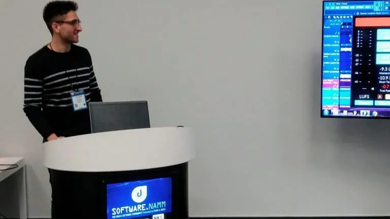
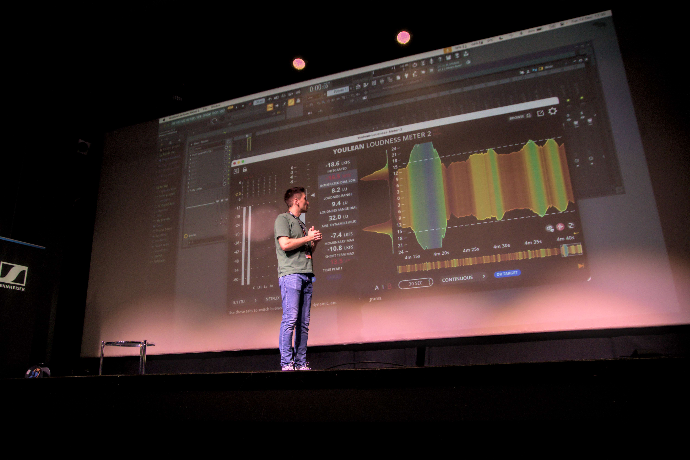

# Development Team

**Youlean Loudness Meter** was and currently is developed by a single developer: **Julijan Nikolic**

The first version was released on **November 30, 2016,** and development is still going on.&#x20;

The development was started for the **KVR Developer Challenge 2016** competition in which Youlean Loudness Meter got the top votes and first place.&#x20;

The winning product was then presented at **NAMM 2017** in Los Angeles, USA.

<figure><figcaption>
Julijan Nikolic at NAMM 2017
</figcaption></figure>

Since then, Youlean Loudness Meter has had a lot of new features added.

<figure><figcaption>
Presenting new features added in V2.5.X BETAs
</figcaption></figure>
