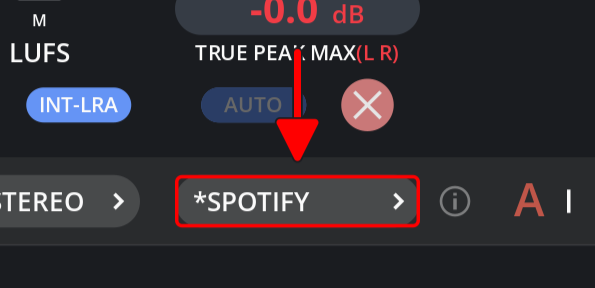

# Interface Overview

<figure><figcaption></figcaption></figure>

***

## Channel Configuration&#x20;

<figure><figcaption></figcaption></figure>

Use this dropdown menu to change the channel configuration.


Configurations marked with **(A)** indicate an automatic recognition by the system. You can rely on these settings for standard operations, but adjustments can be made from the dropdown menu if necessary.


***

## Presets

<figure><figcaption></figcaption></figure>

Use this dropdown menu to change the meter preset.


Presets marked with an asterisk (**\***) indicate that the settings have been modified from their initial state.


***

<figure><figcaption></figcaption></figure>

To set a preset as the default, simply click the **"Set Default"** option in the dropdown menu. Once you've set a preset as your default, it will automatically load each time the meter is loaded, ensuring a consistent setup tailored to your preferences.

***

<figure><figcaption></figcaption></figure>

To import a preset, navigate to the **"Import"** option in the dropdown menu and select the file you wish to import. This allows you to quickly apply configurations from previously saved presets, streamlining your setup process.

***

<figure><figcaption></figcaption></figure>

Click "**Save Preset"** to store your current settings for future use, ensuring easy access and application of your preferred configurations.


Saved presets encompass all meter settings, including GUI size, to ensure consistent loading of necessary configurations across different systems.


***

<figure><figcaption></figcaption></figure>

Hover your mouse over the **"i"** button to preview the current preset alerts and targets.

***

## Pause Measurements

<figure><figcaption></figcaption></figure>

If you click here, you can pause all measurements.


After file analysis or normalization, measurements will be paused automatically.&#x20;

